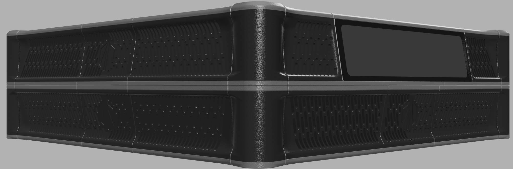

# Darkmatter Skirts

I didn't expect this project to become so desired, given the large (expensive) screen. But here we are.

The enthusiasm behind these skirts intended for the Doom Voron V2 (250, 300 and 350 specs supports) and the Waveshare 11.9" screen (DSI recommended). This design also only the typical filtered mains inlet and separate rocker switch.

Completed installation image courtesy of my good friend tæ
